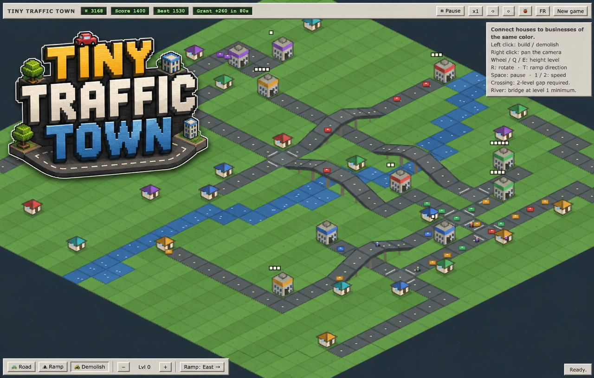

# 🚗 Tiny Traffic Town




*A tiny isometric traffic-management game with big late-90s energy.*
A mini motorways with RollerCoaster Tycoon bridges.

Built in one hour during a rainy lunch break using Claude Fable 5.

Connect colorful houses to matching businesses, and watch your beautiful road network slowly descend into gridlock — because in this town, everyone stops at the yield sign. Even the bikes. **Especially** the bikes.

100% browser, 100% TypeScript, 0 backend, 0 external assets — every pixel is drawn
procedurally on a chunky low-res canvas, the way nature intended in 1999.

## 🕹 Play it

Play online: **https://pyrou.github.io/tinytraffictown/**

Or run it locally:

```bash
npm install
npm run dev
```

Open the URL Vite prints (default: http://localhost:5173). That's it.
The interface speaks both **French and English** — hit the FR/EN button to switch.

On first launch, a welcome screen explains the basics — hit "Play" to dismiss it
(it won't come back), or click the title bar any time to bring it back.

## 🔗 Sharing your map

Hit **Share** to copy a link containing your current road network and buildings —
send it to a friend and they'll start a fresh game on your layout.

## 📦 How it works

- **Businesses** generate orders. **Cars** leave houses of the same color, drive
  over, deliver, and head home. Every delivery pays credits and score.
- Roads **cost credits**; demolishing **refunds 100%**. No scams here.
- Let a business pile up more than 5 pending orders and a red danger bar starts
  filling. Hit 100% and it's **bankruptcy** — game over.
- New houses and businesses keep popping up, with new colors over time. The town
  always grows more houses than businesses — but the orders never stop.
- **Bikes** wander from house to house just to get in everyone's way. They ride at
  75% speed and you can't overtake them. You will learn to hate them. Lovingly.
- The map is dotted with decorative **trees** — building a road or a building on
  one cuts it down for good.

## 🛣 Roads with altitude (the RCT way)

- Ground roads, **elevated roads** on pillars (levels 1–4), and **ramps** to climb
  one level at a time.
- Two roads may only cross with a **vertical gap of 2** — so a proper overpass is:
  ramp up, ramp up again, bridge at level 2, glorious.
- **2x2 road blocks are forbidden.** The traffic laws of this town were not written
  for roundabout-squares. (A ramp in the inner corner of a turn is fine.)

## 🚦 Rules of the road

Everything drives like a very polite, very stubborn simulation:

- **Right-hand traffic**, two lanes per tile — oncoming cars pass each other cleanly.
- **No overtaking.** If the car ahead stops, you stop. Form a queue. Be civilized.
- Every T and X junction is a **yield with priority-to-the-right**: vehicles come to
  a **full stop** (even on an empty road — rules are rules), then go only if the
  junction is free and nobody's coming from the right.
- Stops and starts are instant. No physics degree required.
- If four cars all yield to each other forever, the most impatient one eventually
  just goes. Like real life.

## ⌨️ Controls

| Action | Input |
|---|---|
| Build / demolish | Left click (drag to paint) |
| Pan camera | Right / middle drag, arrow keys |
| Rotate camera 0/90/180/270° | `R` or ⟲ ⟳ buttons |
| Build height level | Mouse wheel, `Q` / `E` |
| Tools: road / ramp / demolish | `A` / `Z` / `X` |
| Ramp direction | `T` |
| Pause | `Space` |
| Speed x1 / x2 | `1` / `2` |
| Language FR/EN | FR/EN button |

## 🐞 Debug menu

The 🐞 button opens a little cheat panel: spawn a house or business of any color,
or unleash an extra bike on the populace.

## 💾 Saves

Best score, options (camera rotation, speed, language) and your **game in progress**
live in `localStorage`. Close the tab mid-game; it'll be there when you come back.
"New game" wipes the slate.

## 🚀 Deployment

Every push to `main` runs a GitHub Actions workflow
(`.github/workflows/deploy.yml`) that builds the project and publishes `dist/`
to GitHub Pages at `https://pyrou.github.io/tinytraffictown/`.

## 🏗 Under the hood

```
src/
  Config.ts            every gameplay constant in one place
  Game.ts              orchestrator: game loop, autosave, game over
  i18n.ts              FR/EN strings (pure module, no DOM)
  core/
    types.ts           directions, road pieces, buildings
    Grid.ts            3D grid, placement rules (crossings, 2x2 ban)
    Pathfinder.ts      multi-source/multi-target A* over the 3D road graph
  sim/Simulation.ts    economy, orders, danger, traffic rules, bikes — headless
  render/Renderer.ts   procedural isometric Canvas 2D, camera rotation
  input/Input.ts       mouse, keyboard, build tools
  ui/UI.ts             Win9x-style HUD, debug menu, game-over screen
  storage/Storage.ts   localStorage wrapper
```

Strict TypeScript, no runtime dependencies, no sprite sheets — roads, buildings,
cars and bikes are all drawn with `fillRect` and stubbornness, then upscaled with
`image-rendering: pixelated` for that authentic management-game-from-your-childhood
look.

`npm run build` type-checks (strict) and bundles. The whole game gzips to ~12 kB,
which is smaller than the average favicon these days.

## 📜 Credits

Inspired by the *vibe* of RollerCoaster Tycoon 2 and Mini Motorways — no assets,
names, sprites or sounds were copied. All bugs are artisanal and locally sourced.
